# 边侧观鸟器 · 检测+分类 开发笔记

> **这是什么**:观鸟器端侧 AI(粗检测→细分类)从「背景/限制 → 数据 → 训练 → 量化 → 联合」的**开发笔记**——
> 一条连贯的逻辑线,既有硬指标决策,也有训练时才踩出来的软经验。不是纯实验报告。
> **怎么读**:§1–§4 是地基(我们做什么、被什么限制住、整体管线 + 采集端/同类参考);§5–§6 是数据;§7–§9 是检测、分类、联合;§10 外部生态 / 选型参考;§11 现状待办。
> 散落的 💡 是"踩坑/软发现"。
>
> 口径:端侧 **INT8 才算数**;量化前后贯穿各节。除特别说明,叙述基线 = 本轮细化训练(检测 feeder_416 / 分类裁框 V2)。

---

## §1 背景:我们在做什么

### 1.1 产品:观鸟器(喂鸟器相机)
一台装在户外喂食点的边侧 AI 相机:**鸟来了,拍下来、认出来**——是什么鸟、什么置信度,顺带挡住松鼠/猫等"非鸟"干扰。
卖点是**"自动鸟种识别 + 隐私(原始画面不出设备)+ 低功耗常驻"**,本质是一个 **AI + IoT 的用户体验产品**,不是一个云端模型服务。

### 1.2 宏观:一个端侧 AI 视觉产品长什么样
```
动检触发 → 采集 → 【端侧 AI 识别】 → 置信门控/层级回退 → 结构化事件 → 端云协同 → App/OTA
```
- **原始视频永不离设备,只上"结构化事件"**(种 + 置信 + top5)——隐私 + 省云算力 + 合规(海外发行)。
- **端侧吃常见种,云端留长尾/疑难锚点**(本项目只留接口、不实现云端)。
- 区域/月份候选清单、模型,都能**OTA** 下发,换地区/换季不重训不重发设备。

### 1.3 我们这块在哪
**不是触发点**(触发由动检/AI-ISP 负责),而是**触发之后的第一个 AI 节点**——对画面回答两个问题:
**「是不是鸟(粗检测)」→「是什么鸟(细分类)」**。这就是本笔记的全部内容。

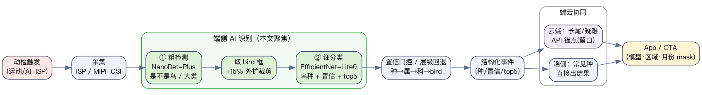

---

## §2 限制:硬件平台(0.5T 级 NPU)

目标平台是全志 **V851S**(V 系列智慧视觉芯片之一),整条选型逻辑都被它的能力框住。

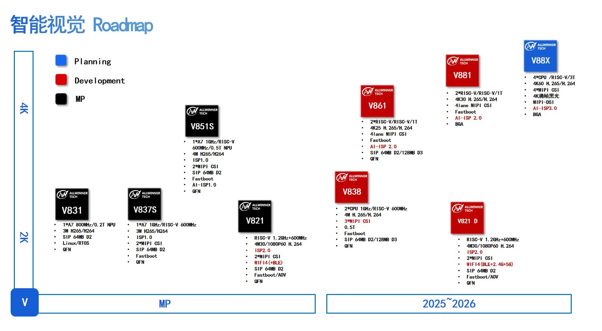

### 2.1 V851S 关键参数(据 datasheet / roadmap)

| 项 | 规格 |
|---|---|
| CPU | 1× Cortex-**A7 @ 1GHz** + RISC-V @ 600MHz |
| **NPU** | **0.5 TOPS,INT8-only(无 FP)** |
| **内存** | **SIP 64MB DDR**(片上封装,容量很紧)|
| ISP | ISP1.0 / **AI-ISP1.0** |
| 视频 | H.265/H.264,4M |
| 摄像头 | 2× MIPI-CSI |
| 其他 | Fastboot、QFN 封装 |

> 我们**不锁死 V851S**:plan 里写明 **0.5–1 TOPS / 内存下限按 64–128MB** 这一档都可,选型按"这一档的共性约束"做。

### 2.2 这些参数怎么压着我们(全文地基)

| 约束 | 直接影响 |
|---|---|
| **内存仅 64MB** | 模型参数 + 激活都得小 → 选**小模型/小输入**,不能上大网络 |
| **NPU INT8-only、无 FP** | **量化是必经**;且 Vivante 私有量化 → **上游只产 FP32 ONNX,绝不上游 INT8**,INT8 交 ACUITY/pegasus PTQ → `.nb` |
| **NPU 算子受限** | 避 **Focus/slice、SE/h-swish、transformer/attention**;检测**后处理(decode/NMS)留 A7 CPU**,不进 NPU 图 |
| **海外商用发行** | **许可红线**:全栈 Apache/MIT/BSD + 数据 CC0/CC-BY;避 AGPL/GPL/CC-BY-NC |

---

## §3 由限制直接得到的选型(先列,后详述)

下面这些是"看一眼约束就能定"的,后面章节再展开:

| 决策 | 来自哪条约束 |
|---|---|
| backbone 选 **INT8 友好**(去 SE/swish 的 EfficientNet-Lite;ShuffleNet)| INT8-only |
| **小输入**(分类 224、检测 416)| 64MB 内存 |
| 量化用 **PTQ(per-channel)**,先本地 ORT-QDQ 模拟、再 ACUITY 真机 | INT8-only + 无官方 QAT |
| **上游只交 FP32 ONNX** | Vivante 私有量化 |
| 检测**后处理留 CPU**、导"裸 backbone+head" | 算子受限 |
| 模型族避 **YOLO(AGPL)/带 Focus**;数据只用 **CC0/CC-BY+自采** | 许可红线 |

---

## §4 整体管线 / 架构

从数据到(未来)部署的全链路,以及每步的技术栈。**注意:`.nb` 真机量化与上板尚未做(W1),图中虚线标出。**

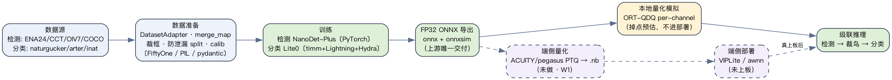

### 4.1 采集端:最佳帧选择(IQA + 主体打分,不碰 LLM)

检测/分类之前,先从**连拍窗口**里挑「最佳帧」——纯**图像质量评估(IQA)+ 主体打分**,传统 CV、端侧零负担、可商用,**完全不碰 LLM**。对每帧算一个综合分、取最高:

| 信号 | 怎么算 | 作用 |
|---|---|---|
| 检测置信度 + 框面积 | 检测器输出 | 鸟清晰且够大 |
| 居中度 / 边缘截断 | 框中心偏移、是否贴画面边 | 主体完整、不被切掉 |
| **裁剪区清晰度** | **拉普拉斯方差**(OpenCV 一行) | **抗运动模糊的主力信号**,几乎零成本 |
| 曝光 / 对比度 | 亮度 / 对比度统计 | 避免过曝、死黑 |
| 进阶(可选,难度高) | 睁眼 / 头部可见 / 姿态 | 提「出片率」 |

💡 **库选型(商用口径)**:OpenCV(Apache,拉普拉斯方差打底)、Katna(关键帧)、MediaPipe(智能构图)均**可商用**;⚠️ **pyiqa 非商用 → 只做原型选型,不进发行**。

### 4.2 同类参考:Frigate(MIT,端侧门控/录制主线)

我们「**动检唤醒 → 有鸟门控 → 升级触发 → 录片**」这条主线,最该参考的成熟项目是 **Frigate**(MIT,部分可 fork):开源本地 NVR、**实时本地检测、视频不上云**、靠 Coral TPU 等边缘加速、MQTT 触发事件。它的 `motion → detect → zone → event → record → clip → notify` 管线,基本就是我们这套端侧门控**做成熟的样子**——可整段参考、按需 fork。

💡 **授权坑**:检测常用的 Ultralytics YOLO 是 **AGPL**(商用要单独授权)、YOLOv9 是 **GPL**(与 Frigate 的 MIT 兼容);选检测 backbone 必须**避开 AGPL**——这正是我们用 NanoDet(Apache)而非 Ultralytics 系的原因(§3)。

---

## §5 数据集

两段任务各用了一批数据。先逐个交代"长什么样、标注 schema、是否商用",再讲怎么统一(§6)。

### 5.1 检测数据集(5 类:bird / squirrel / cat / person / other_animal)

> 检测训练**必须带框**(回归位置)。下面三个训练集都带框;COCO 仅作可行性评估。
> ⚠️ 检测原始图在已删除的训练机上,这里以 **schema(标注格式)** 为主交代;真实"检测框长什么样"见 §9 级联图(我方检测器在真鸟图上画的框)。

| 数据集 | 角色 | 标注 schema | 是否商用 |
|---|---|---|---|
| **ENA24** | 训练 | 相机陷阱、单帧、**全带框**(动物 bbox + 类),无空图 | ✅ 进训练 |
| **Caltech-CT** | 训练 | 相机陷阱;**动物带框** + 大量**空帧作负样本**(空帧无框);按 location 防泄漏 | ✅ 进训练 |
| **OpenImagesV7** | 训练 | 检测 bbox + 类;**逐图 CC-BY 署名**;FiftyOne 按类拉 | ✅ 进训练(逐图署名)|
| **COCO2017** | **仅评估** | 检测 bbox + 类(标准 COCO json)| ⚠️ 不进商用训练 |

💡 **空帧负样本**:Caltech-CT 的空帧没有框,但正是检测训练要的"硬负样本"——教模型"这里没目标"。所以"没框"≠不能用,负样本本就不需要框。

### 5.2 分类数据集(360 种鸟,全部可商用)

> 都是 GBIF 来源的公民科学实拍;逐图过滤只留 CC0/CC-BY。schema = 图 + 学名标签(inat 还带经纬/日期)。

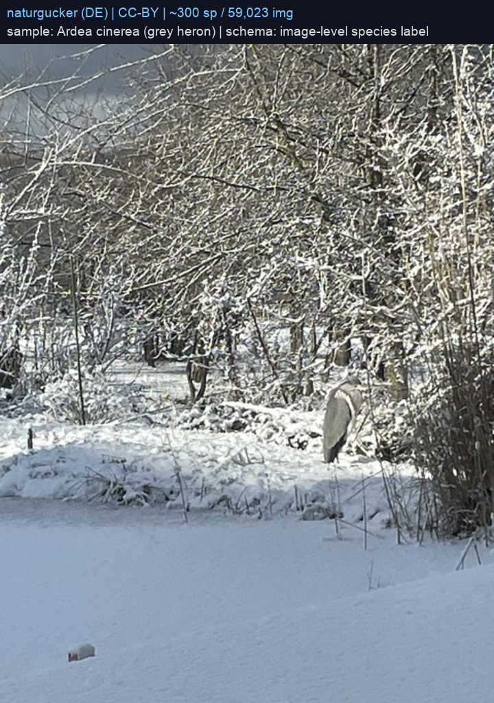
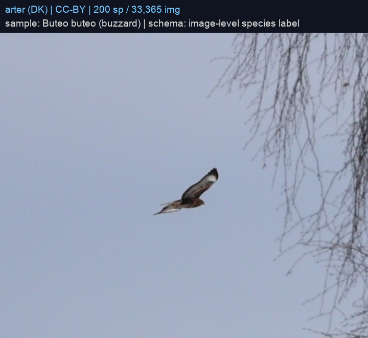
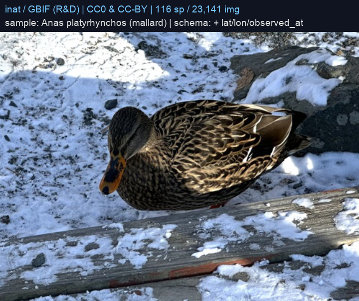

| 源 | 种 | 图 | license | schema |
|---|---|---|---|---|
| naturgucker(德) | ~300 | 59,023 | CC-BY | 图 + 学名 |
| arter(丹) | 200 | 33,365 | CC-BY | 图 + 学名 |
| inat(GBIF) | 116 | 23,141 | CC0 / CC-BY(R&D)| 图 + 学名 + 经纬/日期 |
| **合并** | **360** | **115,529** | 逐图 0 含 NC | 统一 manifest |

💡 norwegian 源原本也抓了(~2.7 万图),但图源 trickle 慢 + 残留 index 损坏,**弃用**;inat 抓到稀有种 trickle 极慢,手动切在 116 种。

💡 **「可商用」≠「能发行」——iNat 要单拎**:三源都过了逐图 CC0/CC-BY 过滤(合并后 0 含 NC),但 **iNat 的 ToS 仍禁止商用 AI 训练(连 CC0 也禁)+ 元数据 license 不明** → 它那 116 种只能 **R&D**,发行前必解(书面澄清 / 换掉,ADR-0005)。**naturgucker + arter(都 CC-BY)才是干净的商用配置**;norwegian 本身也 CC-BY、可商用,**修好下载就能捞回**(补回欧洲覆盖——但补不了北美,北美还得靠 iNat 解许可或自建 feeder)。

---

## §6 数据怎么变成"一致可训练数据集"

各数据集格式天差地别,统一是单独一件工程。

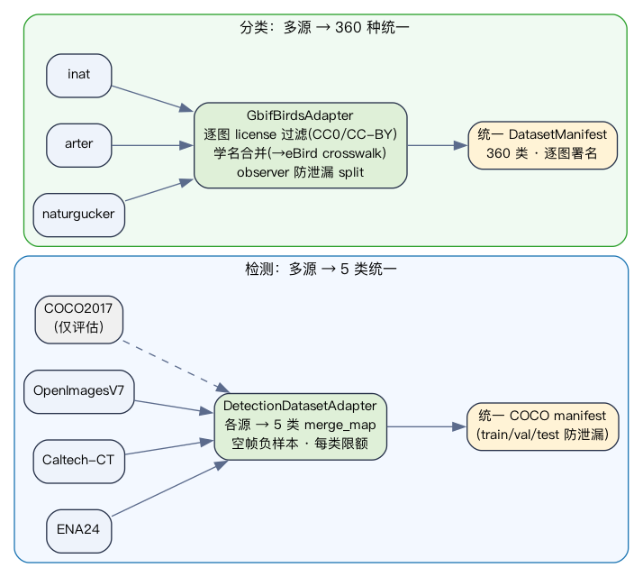

- **检测**:每源一个 `DatasetAdapter` → 各自类名 **merge_map 到 5 类** → 空帧负样本 + 每类限额(治不平衡)→ 防泄漏 split(按 image/location)→ 统一 COCO manifest。
- **分类**:`GbifBirdsAdapter` 源无关读 index.csv → **逐图 license 过滤(只留 CC0/CC-BY)** → **学名合并物种类**(`IdentityTaxonomy`;另建了 eBird crosswalk,360 命中 347)→ **observer 防泄漏 split** → 统一 `DatasetManifest` + 逐图署名清册。

💡 多源合一时,各源图都叫 `images/...` 会**路径撞名** → adapter 加 `path_prefix`(record.path = `<源>/images/...`),manifest 才可移植换机。

---

## §7 检测:训练与评估

### 7.1 模型与选型(硬指标淘汰 → NanoDet-Plus)
检测**没做多架构训练对比**,而是用硬指标(许可 + 算子)直接淘汰:

| 候选 | 体量 | 理由 |
|---|---|---|
| YOLOv5/v8/v11(Ultralytics)| n 档 ≈2–3M | **AGPL**:海外商用会传染/需授权 → 红线淘汰 |
| MMYOLO | — | **GPL**,同红线 |
| YOLOX-Nano | ≈0.9M | Apache 但 **stem 用 Focus/slice** → NPU 易回退软算子 → 算子淘汰 |
| MegaDetector | 大 | 通用动物检测器,不适合 0.5T 端侧 → **仅作数据辅助/参考,不部署** |
| **NanoDet-Plus-m** | ≈1.2M,FP32 ONNX ≈5.2MB | Apache + 无 Focus + anchor-free + **后处理可切 A7 CPU** + ShuffleNetV2 端侧友好 → ✅ |

- 结构:ShuffleNetV2 1.0x + GhostPAN + NanoDetPlusHead(aux head,detach_epoch=10);
- **预训练**:finetune 自官方 `nanodet-plus-m_416` COCO 预训练 ckpt。
- 真正的"训练对比"在 **NanoDet 内部**:输入 **320 vs 416**、数据/召回口径。

### 7.2 训练 + 消融(320 vs 416)
配方:416×416、AdamW lr 1e-3 + cosine、batch 96、fp32、~70 epoch、EMA、QFL+GIoU+DFL。
训练干净收敛(loss 单调、val mAP 逐 epoch 升):


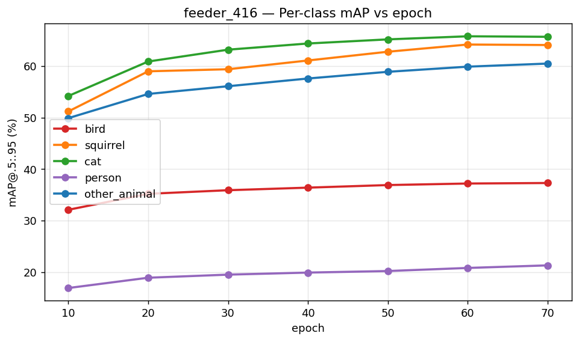

**320→416 对比**(同数据,换分辨率 + 更长训练):


### 7.3 选中:feeder_416 + 效果
best = epoch 70:**mAP@.5:.95 = 0.498 / AP50 = 0.716**。每类:cat 65.7 ≈ squirrel 64.1 > other 60.5 > **bird 37.3** > person 21.3(小目标 AP_small 仅 0.017)。

💡 **命门是 bird 召回,不是 mAP**:喂鸟器"宁多框勿漏",框到鸟交给下游分类就行。bird mAP 37 不致命,**bird 召回**才是产品成立依据:

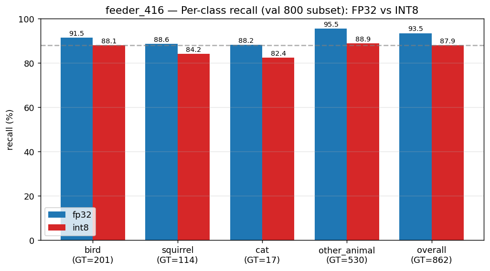

> fp32 bird 召回 **91.5%**,int8 **88.1%**(命门守住);口径对齐,真实喂食器场景比早期基线大幅提升。

### 7.4 量化前后(检测)
ORT-QDQ per-channel/opset13 模拟 INT8(方向性,非板子):

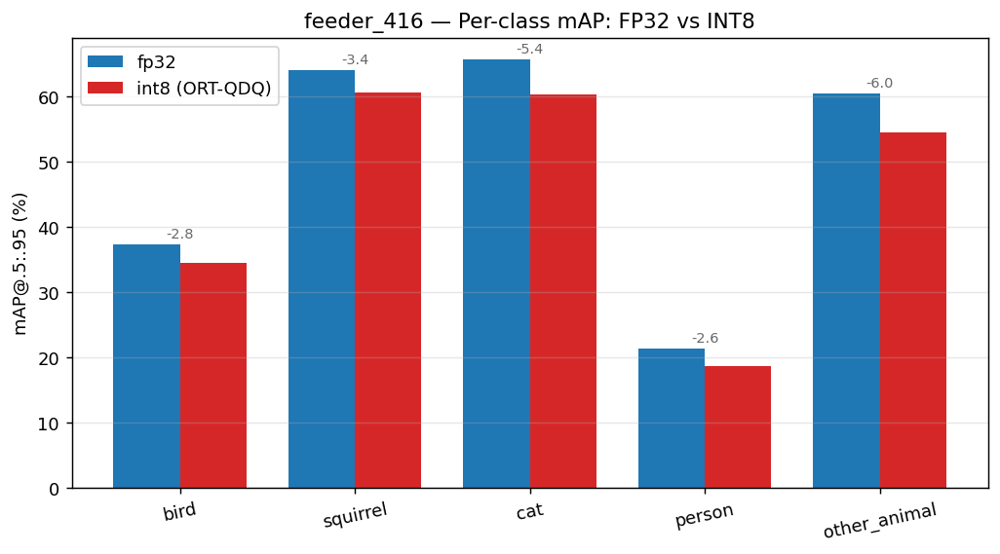

整体 mAP 0.498→**0.457(−4pt)**;每类掉点 other/cat 较多,**bird 最稳(−2.8pt)**。掉点主因是 ShuffleNetV2 INT8 固有损失(增 calib 验证无效),要再压需 QAT/换 backbone 或上板实测。

---

## §8 分类:训练与评估

### 8.1 模型与选型(按 INT8 掉点定 → EfficientNet-Lite0)
分类**真训了对比**,决定性指标是 **INT8 掉点**(端侧跑的是量化后那个数):

| 候选 | 参数 | INT8 掉点 | 理由 |
|---|---|---|---|
| mobilenetv3_large_100 | ≈5.5M | **−3.71pt** | SE+h-swish,INT8 不友好 → ❌ |
| repvgg_a0 | ≈9M | >20% | 需 QARepVGG → ❌ |
| FastViT/MobileViT | — | — | attention,NPU 不友好 → 避 |
| **efficientnet_lite0** | **3.83M**,FP32 ONNX 15M / INT8 4.1M | **−0.19pt** | 去 SE、swish→ReLU6,专为 INT8 设计 → ✅ |

- **预训练**:timm `efficientnet_lite0.ra_in1k`(ImageNet-1k)。
- 训练:224×224、class-weighted CE 治长尾、best-on-val checkpoint、early-stop、AdamW + cosine。

💡 **首训踩坑**:一开始用 `balanced_sampler`(过采样)→ ep10 即过拟合 + 框架**没存 best-on-val**(默认只存末轮)、导出的是过拟合末轮。修:加 ModelCheckpoint(monitor=val_top1)+ 导出最优轮 + 改 `class_weighted`(不重复采样)。

### 8.2 关键消融:整图 vs 检测裁框(+15pt 的故事)
抽样发现:**原图里鸟常只占画面 3%–38%**(很多是远景/多鸟/杂背景):


→ 整图缩到 224 训练 = 让模型"看背景认鸟"。改成**用检测器把鸟框+15%外扩裁出来再训**(裁框版),一举两得:**鸟填满输入(消背景稀释)+ 训练=级联推理(消 domain gap)**。

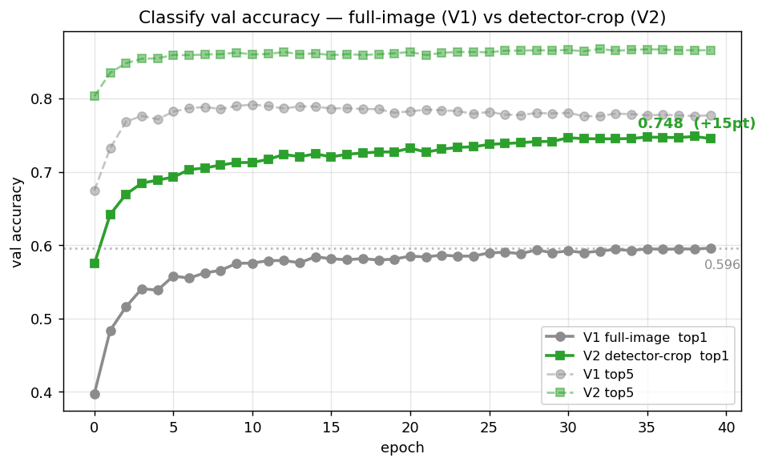

| | 整图 | **检测裁框** |
|---|---|---|
| fp32 top-1 | 0.596 | **0.748(+15.2pt)** |
| **int8 top-1(端侧)** | 0.567 | **0.750** |
| field 退化 | 0.370 | **0.626** |

💡 这是这轮**最大杠杆**——不是调超参,是把"背景稀释"这个数据 confound 干掉了。

### 8.3 量化前后(分类)+ 效果


- **INT8 几乎零掉点**(0.748→0.750)——Lite0 对 INT8 友好。**端侧可部署:75.0% top-1 / 86.7% top-5**。
- 裁框模型**退化鲁棒性也大涨**(field +25.6pt):裁了鸟,退化只作用在鸟身、不被背景拖累。

### 8.4 地域 / 月份 mask(推理后处理,不重训)
训全局头,推理期按"区域/当月在场种"把不在的类 logit 置 -inf(候选清单可 OTA)。正确口径(只在 in-region 子集比 mask on/off):


| 地域 | 覆盖 | 增益 | | 月份(DK)| 增益 |
|---|---|---|---|---|---|
| GB | 0.91 | +0.3pt | | 1月(冬)| **+2.23pt** |
| DK | 0.84 | +0.5pt | | 4月 | +1.47 |
| US | 0.72 | +1.6pt | | 7月 | +1.59 |
| **AU** | **0.28** | **+5.4pt** | | 10月 | +1.62 |

💡 **增益随区域收窄而增大**:本数据 360 种欧洲集中,欧洲 mask 几乎不缩→增益小;AU 仅 99 种在场→候选大缩→+5.4pt。月份在地域之上**叠加**(冬季候鸟离境、候选最窄)。说明地域 mask 的价值在"广域模型→部署到窄区域"时才充分显现。

---

## §9 联合(级联)推理

链路:全图 → 检测器(NanoDet-Plus)裁鸟框+15%外扩 → 分类器(Lite0)→ 置信门控/层级回退。
逐步标注(顶部黑条 ①检测 ②裁框 ③细分种+top5;绿=检测框、黄=分类器外扩输入框):

| 报种正确 ✓ | 报种正确 ✓ | 报种正确 ✓ |
|---|---|---|
| 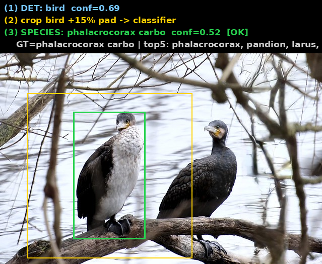 |  | 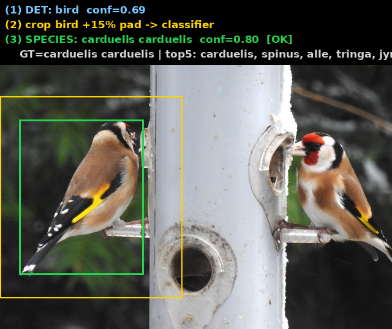 |
| 大鸬鹚 | 大斑啄木鸟 | 红额金翅雀 |
| **报种正确 ✓** | **安全回退** | **自信报错** |
|  |  | 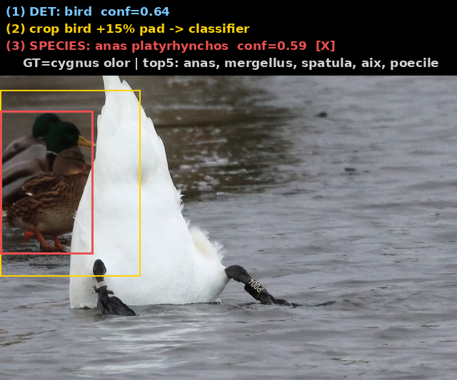 |
| 普通鵟 | 苍鹭→置信不足回退 bird | 疣鼻天鹅误报绿头鸭 |

**级联性能**(20 种鸟):检测 **20/20 全中**;报种 13、正确 11 → **提交时精度 85%**;7 个置信不足**安全回退报 bird**。

💡 分类器单测 75%,但级联里靠**置信门控**做到"**说种时 85% 对,不确定就退报 bird**"(宁粗不错,下游/云端再判)——这正是产品要的分级置信行为。

---

## §10 外部生态 / 选型参考

实验是大头(§7–§9);这里把对齐过的外部研究 / 资产收一收——**为什么这么设计**,以及**哪些能复用、哪些上不了端**。

### 10.1 研究佐证:RealBirdID(UMass, 2026)

基准论文 [arXiv:2603.27033](https://arxiv.org/abs/2603.27033)(google/cameratrapai 同领域,UMass CVL),正面印证本项目取向:

| 结论 | 数 / 含义 |
|---|---|
| 多模态大模型单图认种(GPT-5 / Gemini-2.5 Pro) | **<13%** 准确率 → 不能直接拿 MLLM 出种 |
| 最强视觉编码器 BioCLIP | species / genus AUC 30.1% / 57.0%(也不高) |
| 分类强 ≠ 会拒答 | 模型普遍不懂「何时该拒答」,即便拒答也常给错理由 |
| 单图常**不可判定** | 线索可能非视觉(鸟鸣)或被遮挡 / 角度 / 低分辨率抹掉 → 需鸟鸣 / 地理 / 季节 / 多角度 |
| **加 range map(地域先验)** | 平均分类分 **IG 57.2 → 88.1**;但对「拒答」几乎无改善 |

💡 三条都对得上我们:① 用**专训 Lite0** 出种(绕开 <13% 那道坎);② **置信门控 + 层级回退**(§9)正是论文强调、而大模型缺的「会拒答」;③ **地域 / 月份 mask**(§8.4)与「range map 大幅提升分类」同源——也同样印证「**先验救分类、救不了拒答**」。

### 10.2 可复用底座:SpeciesNet / PyTorch-Wildlife(补非商用坑)

两张 Apache / MIT 的牌,正好补前面鸟图数据「非商用」的坑——但**都是云端 / 开发期资产,不是端侧模型**:

| 资产 | 许可 | 是什么 | 怎么用 / 边界 | 上 V85x? |
|---|---|---|---|---|
| **SpeciesNet**(google/cameratrapai) | Apache 2.0 | MegaDetector + **EffNetV2-M**,65M 图、**2000+ 标签**(物种 / 高阶 taxa / 空帧 / 车)、地理先验 | 当「云端大分类器 + 空帧过滤 + 微调底座」;口径是 2000 类野生动物、非细粒度鸟种 → 要在它上面用回流数据微调 | **❌ 不能** |
| **PyTorch-Wildlife**(microsoft/CameraTraps) | MIT | 保护 AI 框架 / 模型动物园 / 微调工具 | 开发期脚手架、取预训练权重;**不替换** timm+Lightning 栈,与端侧部署无关 | — (纯 dev) |

> Google 公布(未独立复核):SpeciesNet 含动物图检出 **99.4%**、做种级判断 **94.5%**,且为夜间红外的模糊 / 遮挡优化。

**SpeciesNet 为什么上不了端**(V85x:0.5T / 内存下限 64–128MB,INT8-only):① 分类器 EffNetV2-M **~54M(~14× Lite0)**、INT8 权重 ~54MB,单这一项就吃掉内存下限近一半;② **SE + SiLU** 在 Vivante VIP NPU 多半**回退软算子**(正是我们选 Lite0 去 SE、swish→ReLU6 的原因,§3 / §8.1);③ 它默认捆 **MegaDetector v5 = YOLOv5 系**,带 Focus + AGPL,双踩红线(我们用自己的 NanoDet,不碰它的检测段)。

💡 **商用小字**:SpeciesNet 代码 Apache、可商用,但权重托管 Kaggle 有自己条款 + 65M 训练数据 provenance 不透明 → 仍是「输出授权灰区」;当**云端推理底座**最干净,要**蒸馏 / 微调进可发行端侧权重**则走 ADR-0005 谨慎核(teacher 含 NC 会传染 student)。PyTorch-Wildlife 框架 MIT 干净,但它 wrap 的权重(默认 MDv5 / AGPL)别打进发行件。

> 与既有判断一致:`docs/classify/01 §2` 早把 SpeciesNet 标「服务器级、第一版不上端」——这里把正确位置说清:**端侧 ❌、云端底座 / 开发脚手架 ✅**。

---

## §11 现状 / 待办

**已闭环(本地)**:检测 + 分类训练、FP32 ONNX 导出、ORT-QDQ INT8 模拟、级联、地域/月份 mask、量化前后对比。
**端侧 INT8 可部署数字**:检测 bird 召回 88%、分类 75.0%/86.7%。

**待办**:
1. **真上板**:ACUITY/pegasus PTQ → `.nb` → VIPLite 实测真实掉点 + 延迟(W1,工具链未通,最大盲点)。
2. **真实 feeder 数据**:自采喂鸟器 crop(遮挡/背身/夜视/多鸟),补 field 与真实场景差。
3. **区域∩月份组合 mask + OTA** 下发。
4. **长尾/近似种**:置信门控阈值调优 + genus/family 辅助 loss。

---

### 附:踩坑 / 软发现速查
- **裁框 +15pt**:数据本质(鸟占画面小)决定的最大杠杆,非超参。
- **best-on-val 缺失**:Lightning 默认只存末轮 → 过拟合时导出最差轮;必须显式 ModelCheckpoint + 导出最优轮。
- **onnx 导出设备坑**:load_from_checkpoint 后模型在 GPU、dummy 在 CPU → 导出/对齐崩 → 统一 `.cpu()`。
- **GBIF**:`scientificName` 参数不真过滤(返回全国鸟数)→ 改 `species/match→usageKey→facet`;`network_turbo` 拖慢非 github 流量 → GBIF 直连反而快。
- **ORT 无 GPU provider**:裁 11.5 万图 → 多进程(48 并行)跑满 208 核。
- **Hydra**:ckpt 文件名含 `=`(`epoch=38`)会被 override 语法解析炸 → 复制成无 `=` 名再传。

---
*开发笔记 · 2026-06 · 训练在 RTX 3090(检测)/ 5090(分类)。图表/数据可在仓库 `results/` 复现。*
