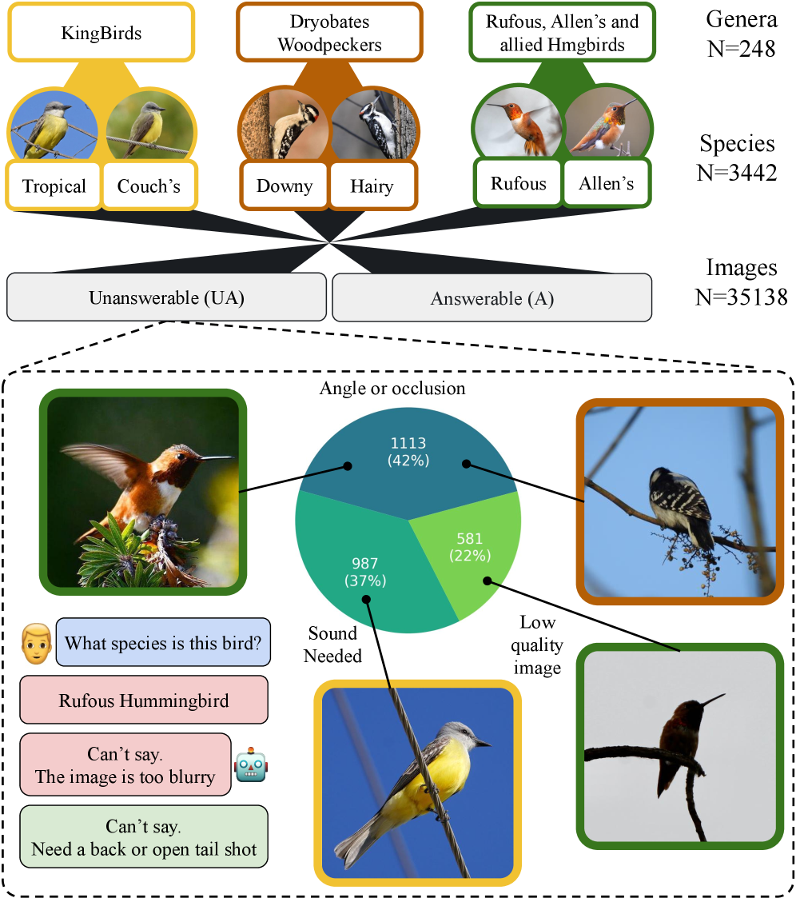
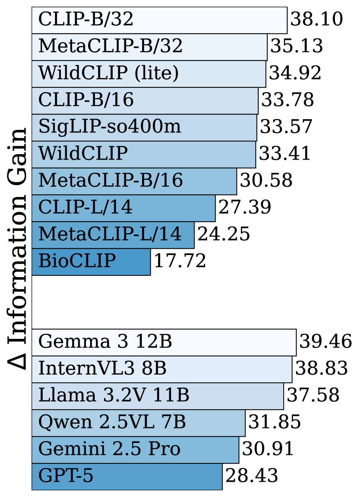
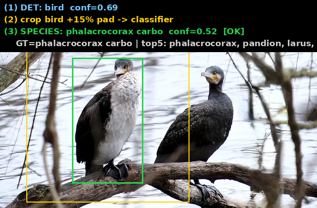
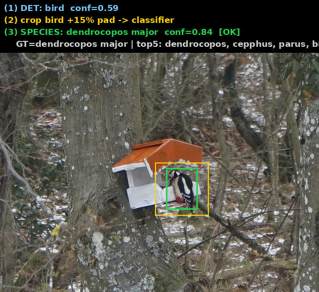
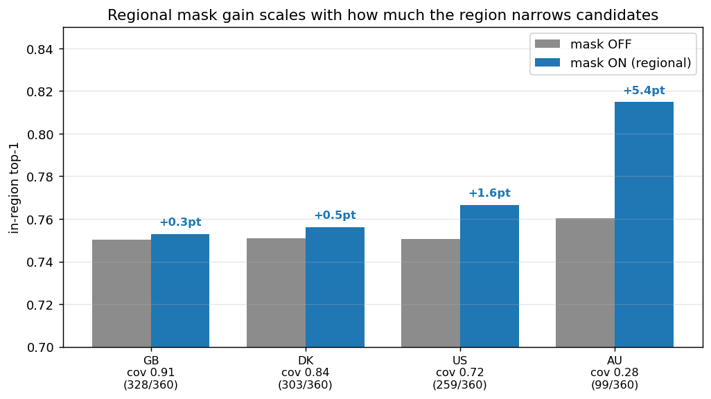

# 鸟种细分类 实验报告 · EfficientNet-Lite0（feeder 360 种）

> 范围：edge-cam-train **细分类段**（级联第二段）。主线 = **检测裁框版（V2）**，对照整图版（V1）。
> 口径：自有 test split top-1/top-5；量化为 **ORT-QDQ 模拟 INT8**（方向性，非板子）。「**INT8 数才算数**」。
> 数据：iNat + naturgucker + arter 三源 GBIF，**CC0/CC-BY 可商用**，360 种、115529 张。
> 硬件：RTX 5090（westc，cu128）。产物：`results/classify/{v1_fullimage,v2_crop,cascade_v2}/`。

---

## 0. 一页结论（TL;DR）

| 指标 | V1 整图 | **V2 检测裁框（新基线）** | 提升 |
|---|---|---|---|
| fp32 top-1 | 0.596 | **0.748** | **+15.2pt** |
| **int8 top-1（端侧）** | 0.567 | **0.750**（量化≈零掉点） | **+18.3pt** |
| top-5（int8） | 0.762 | **0.867** | +10.5pt |
| field 退化 top-1 | 0.370 | **0.626** | +25.6pt |
| 级联提交精度 | 75% | **85%** | +10pt |

**头条**：把训练输入从「整图」换成「**检测器裁出的鸟框+15%外扩**」，top-1 **0.596 → 0.748（+15.2pt）**、
端侧 INT8 **0.567 → 0.750（+18.3pt）**、退化鲁棒 **+25.6pt**。**端侧可部署：75.0% top-1 / 86.7% top-5，INT8 免费。**

**Gate: PASS ✅**（ADR-0001 暂不设硬门，先看包络）。

---

## 1. 这段在级联里的位置

```
原图 ─[粗检测 NanoDet feeder_416]→ bird 框 ─裁框+15%外扩─[细分类 Lite0 360种]→ 种+置信+top5
                                                              └ 低置信/框太小 → 回退报 bird（宁粗不错）
```
- 细分类**只在检测器框到 bird 后**对 crop 工作 → 训练就该喂「检测器裁框」，不是整图（本报告核心，§3）。
- backbone = **EfficientNet-Lite0@224**（去 SE/swish、swish→ReLU6，对 INT8 PTQ 友好，最 NPU 安全；端侧 INT8-only）。
- 端侧只认常见种、长尾交云；层级回退（种→属→科→bird）+ 置信门控（`cascade/pipeline.py`）。

---

## 🔬 外部佐证 · RealBirdID（UMass, 2026）：大模型直接认鸟为何不靠谱

> Lawrence et al., *RealBirdID: Benchmarking Bird Species Identification in the Era of MLLMs*，UMass CVL（含 Subhransu Maji、Grant Van Horn）。[arXiv:2603.27033](https://arxiv.org/abs/2603.27033) · [代码/数据](https://github.com/cvl-umass/RealBirdID)

一篇刚出的基准论文，正面印证了本项目「**不靠多模态大模型直接出种 + 必须会拒答 + 地域/季节先验**」的设计取向。

**它做了什么**：给一张鸟图，系统要么报种，**要么基于证据拒答**——理由限定为「需要鸟鸣（requires vocalization）」「图像质量太差（low quality image）」「视角被挡（view obstructed）」。每个属都配一组**不可判定（Unanswerable, UA）**样本 + 一组**可判定（Answerable, A）**样本。



*（论文 Fig.1）三个易混属（KingBirds / Dryobates 啄木鸟 / Rufous-Allen 蜂鸟）各有易混种对；很多图本就「不可判定」——示例直接给出「太糊，说不了」「需要背面或展开尾羽的照片」这类拒答理由。*

**三条核心结论**（都与我们相关）：

1. **单图认种本身就很难**：开源/闭源模型在「可判定」集上都吃力——**多模态大模型（含 GPT-5、Gemini-2.5 Pro）种级准确率 <13%**；最强的视觉编码器 BioCLIP 也只有 30.1% species AUC。
2. **分类强 ≠ 会拒答**：分类能力更强的模型，并不更懂「什么时候该拒答」（abstention 校准与分类能力不相关）。
3. **拒答也常给错理由**：即便模型选择拒答，也普遍给不出正确的证据性理由。

**为什么很多鸟图单张不可判定**：关键线索可能**非视觉**（鸟鸣），或被**遮挡 / 角度 / 低分辨率**抹掉——需要鸟鸣、地理位置、季节、更多角度，或图本身太糊 / 被挡。

**「怎么提升 + 提升多少」——地域先验（range map）是最大杠杆**：



*（论文 Fig.6）按 range map（物种在场区域）约束候选后，跨模型平均分类分 **IG 57.2 → 88.1**（σ 9.4→2.1，更稳）；但对「拒答」几乎无改善，对 MLLM 反而变差。*

| RealBirdID 量化结论 | 数 |
|---|---|
| MLLM 单图种级准确率（GPT-5 / Gemini-2.5 Pro 等） | **<13%** |
| 最强视觉编码器 BioCLIP，species / genus AUC | 30.1% / 57.0% |
| 多模态大模型 species AUC 区间 | 3.2–21.5% |
| **加 range map（地域先验）后平均分类分 IG** | **57.2 → 88.1** |
| 加 range map 对「拒答」的改善 | 几乎无（45.8 → 47.7），对 MLLM 反而变差 |

**对本项目的印证**：① 我们用**专训的 Lite0** 出种（不用 MLLM），正是绕开 <13% 这道坎；② **置信门控 + 层级回退（种→属→科→bird）**就是论文反复强调、而大模型缺失的「会拒答」；③ §7 的**地域/月份 mask** 与论文「range map 大幅提升分类」同源——也同样印证：**先验救分类、但救不了拒答**（拒答得靠我们自己的门控）。

---

## 2. 数据：360 种 / 11.5 万张可商用实拍

| 源 | 种 | 图 | license |
|---|---|---|---|
| naturgucker（德） | ~300 | 59023 | CC-BY |
| arter（丹） | 200 | 33365 | CC-BY |
| inat（R&D） | 116 | 23141 | CC0/CC-BY |
| **合并（按学名）** | **360** | **115529** | 逐图过滤，0 含 NC |

防泄漏 split（observer 分组）：train 96128 / val 9545 / test 9856，每 split 全 360 种。逐图署名清册随产物。

### 许可分层：哪些能直接商用，哪些是未决项

三源 license 标签都过了 CC0/CC-BY 逐图过滤（合并后 0 含 NC），但**「标签可商用」≠「能直接发行」**——iNat 要单拎出来：

- ⚠️ **iNat 是真正的未决项**：就算图标了 CC0/CC-BY，iNat 的 **ToS 仍禁止商用 AI 训练（连 CC0 也禁）+ 元数据表本身 license 不明** → 商用发行前必须解决（书面澄清 or 换掉）。所以 inat 那 116 种 / 23k 图只能 **R&D 开发用**，不进可发行权重（[[ADR-0005]]）。
- ✅ **naturgucker + arter（都是 CC-BY）才是干净的商用配置**：直接砍掉 iNat、只留这两源，就是合规可发行的权重——合理的商用基线。
- 🔧 **norwegian 是另一回事**：它本身也是 **CC-BY、可商用**，当初弃用纯粹是**下载坏了**（残留 index 2001 行 vs 27438 图）。哪天修好它的下载捞回来，能补回砍掉 iNat 损失的**欧洲覆盖**——但**补不了北美**（北美还得靠未来 iNat 解许可，或自建 feeder）。

**一句话**：iNat 和 naturgucker 是两回事；商用就砍 iNat、留 naturgucker + arter；想找回覆盖优先修 norwegian，北美缺口只能等 iNat 解许可或自建数据。

### ⚠️ 关键观察：原图里鸟常常很小

抽样 6 张测鸟框占画面比例：**从 3% 到 38%**——很多图鸟只是画面一小块，大半是背景/多鸟。


最极端的欧亚鸲只占 **3%**（栖在鸟笼上，雪/树/栅栏占满画面）：


绿头鸭则是**多鸟+水面**、框还很松：


→ **整图缩到 224 训练 = 让模型在"看背景认鸟"**，鸟被严重稀释。这是 V1 只有 60% 的主因之一。

---

## 3. 核心方法：用检测器（teacher）裁鸟 → 训推一致

**V1（整图）**：`ManifestDataset` 打开整张原图 → `RandomResizedCrop(224, 0.7~1.0)` → 训练；评估直接 `Resize(224)`。
**没跑检测器、没用鸟框**。问题：① 鸟小被背景稀释；② 与级联推理（检测器裁框喂分类器）**训推不一致**（domain gap）。

**V2（检测裁框）**：用 **feeder_416 检测器**对每张训练图取最高分 bird 框 → `expand_to_square(+15%)` → 存 crop → 重训。
```
classify_raw 11.5万图 ─[feeder_416 检测器, 48进程]→ bird框+15%外扩 → 256² crop（manifest 仅换 root）
```
- **99.997% 的图都拿到检测器鸟框**（crop 115525 / 回退 4 / 失败 0）——检测器在野照上极稳。
- 一举两得：鸟填满 224 输入（消背景稀释）+ **训练=级联推理**（消 domain gap）。
- 配方与 V1 完全一致（class_weighted 治长尾 + best-on-val checkpoint + early-stop + wd 1e-3），**唯一变量=输入裁框**，干净对比。

---

## 4. 训练结果：V2 全程压过 V1


- V2 **第 1 个 epoch（0.642）就超过 V1 训满 40ep 的 best（0.596）**；
- V2 best = **0.748 @ ep38**（top5 0.866），V1 best 0.596（top5 0.777）→ **+15.2pt / +8.9pt**；
- 两者均 class_weighted + best-on-val 自动存最优轮，无过拟合回退。

机读：`v1_fullimage/metrics_v2.csv`、`v2_crop/metrics_cropv2.csv`。

---

## 5. INT8 可行性包络：端侧才算数


| 级 | V1 top1/top5 | **V2 top1/top5** | V2 vs fp32 |
|---|---|---|---|
| fp32（val） | 0.596 / 0.777 | **0.748 / 0.866** | — |
| **int8 sim（test）** | 0.567 / 0.762 | **0.750 / 0.867** | **+0.002（≈零掉点）** |
| field（退化代理） | 0.370 / 0.594 | **0.626 / 0.797** | −0.123 |

**三个要点**：
1. **INT8 几乎零掉点**（0.748→0.750）——Lite0 去 SE/swish 对 INT8 PTQ 友好。**端侧 75.0% top-1 / 86.7% top-5 可直接部署**。
2. **退化鲁棒性大涨**（field V1 0.370 → V2 0.626，+25.6pt）——裁了鸟，退化只作用在鸟身、不被背景拖累。
3. INT8 的 V1→V2 增益（+18.3pt）比 fp32（+15.2pt）还大——裁框模型量化更稳。

> 方向性预估，非板子实测；真实掉点须 ACUITY/pegasus PTQ → `.nb` → 上板（W1）。机读 `envelope_v1_vs_v2.csv` / `v2_crop/envelope/`。

---

## 6. 级联联合推理（检测→裁鸟→细分类）

用 V2 分类器跑端到端级联（全图 → 检测器裁框+15%外扩 → Lite0 → 置信门控/层级回退），20 种鸟：

- **检测 20/20 全中**；**报种 13、正确 11 → 提交时精度 85%**（V1 75%）；7 个置信不足**安全回退报 bird**。
- 逐步标注示例（绿=检测框、黄=分类器外扩输入框、顶部黑条=①检测②裁框③细分种+top5，不压图）：

| 报种正确 ✓ | 报种正确 ✓ | 报种正确 ✓ |
|---|---|---|
|  |  |  |
| 大鸬鹚 phalacrocorax carbo | 大斑啄木鸟 dendrocopos major | 红额金翅雀 carduelis carduelis |
| **报种正确 ✓** | **安全回退**（宁粗不错） | **自信报错**（失败模式） |
|  |  |  |
| 普通鵟 buteo buteo | 苍鹭→置信不足回退 bird | 疣鼻天鹅误报绿头鸭 |

**产品含义**：分类器单测 75%，但级联里靠**置信门控**——**说种时 85% 对，不确定就退报 bird**（宁粗不错，下游/云端再判）。
这正是 plan 的分级置信策略。全部 20 例标注图见 `cascade_v2/`。

---

## 🎞️ 端侧最佳帧选择（连拍 → IQA + 主体打分，不碰 LLM）

捕获端从一段**连拍窗口**里挑「最佳帧」再喂给检测→裁框→细分类，这一步**完全不碰 LLM**——它是**图像质量评估（IQA）+ 主体打分**的活儿，纯传统 CV，端侧零负担、且可商用：

- **OpenCV**（Apache 2.0，可商用）：拉普拉斯方差、亮度/对比度统计等基础信号都在里面，是端侧打分的地基。
- **MediaPipe**（Apache 2.0，可商用）：要做「明信片」式自动构图 / 智能裁剪时，它的 saliency / smart-crop 很顺手。

对连拍窗口里**每一帧算一个综合分，取最高**：

| 信号 | 怎么算 | 作用 |
|---|---|---|
| **检测置信度 + 框面积** | 检测器输出 | 鸟清晰且够大 |
| **居中度 / 边缘截断** | 框中心偏移、是否贴画面边 | 主体完整、不被切掉 |
| **裁剪区清晰度** | **拉普拉斯方差**（variance of Laplacian），OpenCV 一行就出 | **抗运动模糊的主力信号**，几乎零成本 |
| **曝光 / 对比度** | 亮度 / 对比度统计 | 避免过曝、死黑 |
| 进阶（可选，定制活，难度高） | 睁眼 / 头部可见 / 姿态 | 提升「出片率」 |

许可口径与 §4 红线一致：OpenCV、MediaPipe 均 **Apache 2.0**，可直接进商用发行；这一步纯端侧、纯打分，不引入任何大模型依赖。

---

## 7. 地域 / 月份 mask 消融（推理期，无需重训）

设计：训全局头 + **推理期按区域 mask**（不在区域的类 logit 置 -inf），区域清单可 OTA 换、不重训（plan §5.4）。
用 **GBIF occurrence（免 key）**给 360 种建各国在场清单（学名直接对类标，无需 eBird code），对 V2 模型在
**in-region 子集**比 mask on/off（**正确口径**：只在「真值∈区域」样本上比，避免把外地真值压 -inf 的假象）。



| 区域 | 覆盖率（在场/360） | in-region n | mask off | mask on | 增益 |
|---|---|---|---|---|---|
| GB 英国 | 0.91（328） | 9243 | 0.750 | 0.753 | +0.28pt |
| DK 丹麦 | 0.84（303） | 8779 | 0.751 | 0.756 | +0.55pt |
| US 美国 | 0.72（259） | 7375 | 0.751 | 0.767 | +1.60pt |
| **AU 澳洲** | **0.28（99）** | 3251 | 0.760 | **0.815** | **+5.44pt** |

**结论：地域增益与「区域收窄程度」强相关**。本数据 360 种**欧洲集中**→欧洲区域（GB/DK）几乎不缩减、增益微小（+0.3~0.5pt）；
区域越窄（AU 仅 99 种在场）→候选大缩→**增益越大（+5.44pt，0.760→0.815）**。这说明地域 mask 的价值在
**「广域模型 → 部署到较窄区域」**时才充分显现，是产品按区域 OTA 下发候选清单的依据。

### 月份（物候）mask —— 在地域之上叠加

同口径，用 **GBIF 逐种月度 occurrence** 建「某月在丹麦在场」清单（冬季缺夏候鸟 → 候选更窄）：

| DK 月份 | 在场/360 | mask off | mask on | 增益 |
|---|---|---|---|---|
| **1 月（冬）** | 196 | 0.740 | 0.763 | **+2.23pt** |
| 4 月 | 243 | 0.745 | 0.760 | +1.47pt |
| 7 月 | 238 | 0.746 | 0.761 | +1.59pt |
| 10 月 | 238 | 0.745 | 0.761 | +1.62pt |

**月份在地域之上叠加有效**：DK 全年（区域 only）+0.55pt → 加月份 **+1.5~2.2pt**；1 月最窄（候鸟离境）→增益最大。
产品的「区域 ∩ 月份」候选清单可按季 OTA 下发，进一步提精度。

> 机读 `regional/{regional_results,month_results}.json`；清单 `regional/{regions,months}/*.json`；crosswalk `regional/ebird_map.csv`（347/360）。

---

## 8. 结论 / 下一步

**已确立**：检测裁框 + Lite0 + class_weighted + best-on-val + INT8 → **端侧 75.0%/86.7%，量化免费、退化鲁棒、级联提交精度 85%**。可行性成立。

**为什么不是更高**（诚实）：360 种细粒度 + 公民科学照（同种姿态/羽色/幼成差异大 + 标签噪声 + 杂交）+ 端侧小模型（Lite0 3.8M）共同决定上限。裁框已消掉「背景稀释」这一可修 confound（+15pt），剩余是任务与数据的固有难度。

**下一步**（按价值）：
1. **区域 ∩ 月份组合 mask + OTA**——地域(§7)与月份各自已验证有效；产品化为「区域∩月份」候选清单按季 OTA 下发。
2. **真实 feeder 数据**（Stage 3）——自采喂鸟器 crop（遮挡/背身/夜视/多鸟），补 field 与真实场景差。
3. **长尾/近似种**——置信门控阈值调优（现 species_conf=0.5 偏保守，回退率 35%）；genus/family 辅助 loss（可再提分）。
4. **真上板**：ACUITY → `.nb` → VIPLite 实测 INT8 真实掉点 + 延迟。
5. 非鸟动物级联示例（squirrel/cat/…）——待检测集机器开机取图。

---

## 9. 产物清单

| 路径 | 内容 |
|---|---|
| `v2_crop/weights/lite0_crop_best_val0748.ckpt` (44M) | **V2 量化前** best 权重 |
| `v2_crop/weights/efficientnet_lite0_fp32.onnx` (15M) | **V2 量化前** FP32 ONNX（对齐 True） |
| `v2_crop/weights/efficientnet_lite0.int8.onnx` (4.1M) | **V2 量化后** INT8 ONNX（ORT-QDQ，仅消融） |
| `v1_fullimage/weights/*` | V1 整图版对照权重（同三件套） |
| `{v1_fullimage,v2_crop}/envelope/report.{md,json}` | 四级包络报告 |
| `{v1_fullimage,v2_crop}/metrics_*.csv` · `envelope_v1_vs_v2.csv` | 训练曲线 / envelope 机读 |
| `v2_crop/crop_summary.json` | 裁剪统计（crop_rate 1.0） |
| `cascade_v2/ex*.png` + `cascade_examples.json` | 20 例级联逐步标注图 |
| `regional/{regional_results,month_results}.json` · `regions/*.json` · `months/*.json` · `ebird_map.csv` | 地域/月份 mask 结果 + 各国/各月在场清单 + eBird crosswalk |
| `crop_dataset.py` · `cascade_demo.py` · `build_regions.py` · `build_months.py` · `regional_eval.py` · `make_classify_report_assets.py` | 复现脚本 |
| `figures/` | 本报告全部图 |

> 权重为本地存档，**不进 git，走 DVC**。crops（~115k×256²，box `/root/autodl-tmp/classify_crops`）+ 完整预测 dump 留 box。

---
*生成于 2026-06-22；数据/训练在 5090（westc）。图表由 `make_classify_report_assets.py` 复现。*
