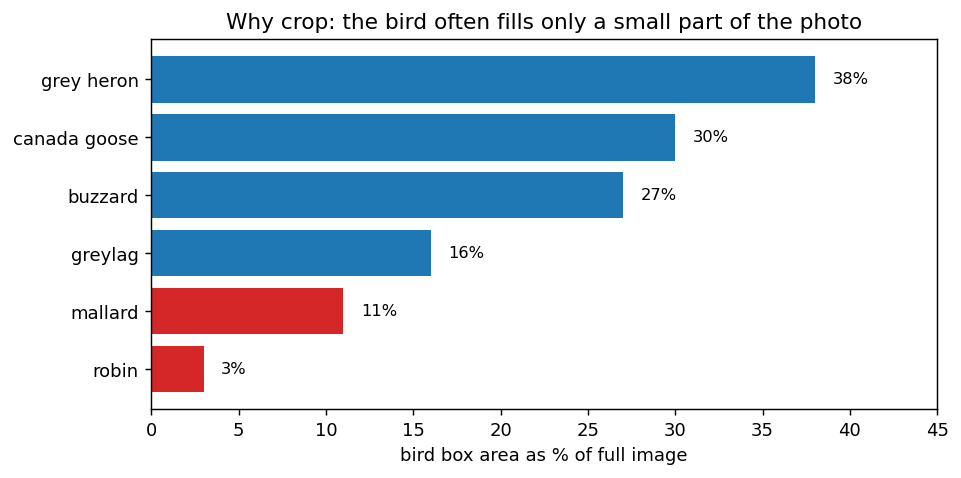
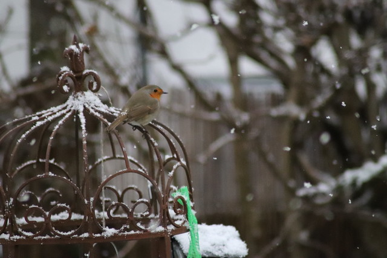
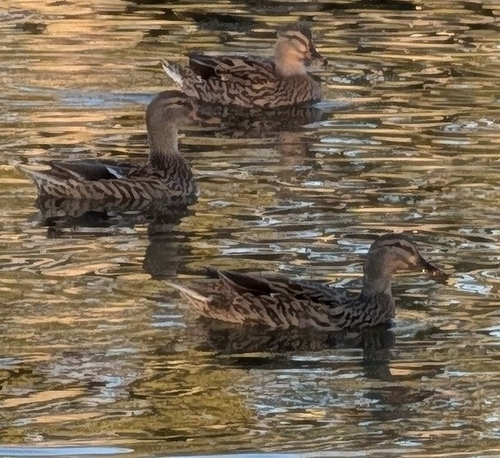
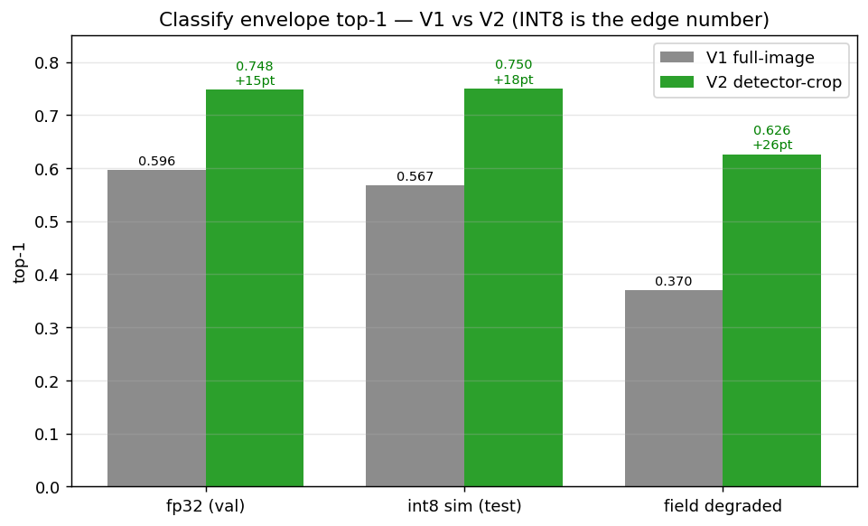
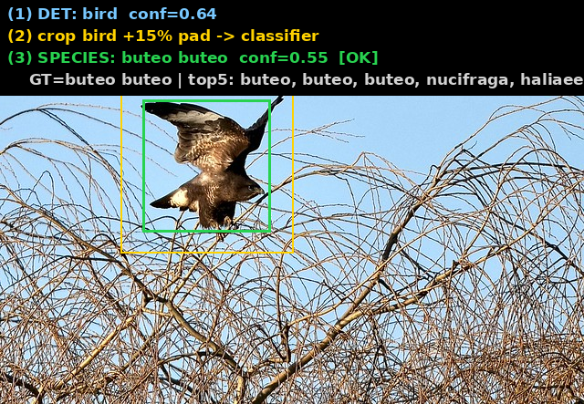
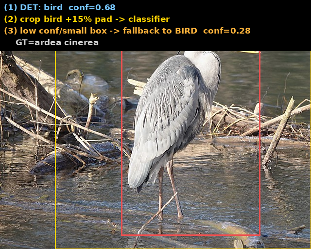

# 鸟种细分类 实验报告 · EfficientNet-Lite0（feeder 360 种）

> 范围：edge-cam-train **细分类段**（级联第二段）。主线 = **检测裁框版（V2）**，对照整图版（V1）。
> 口径：自有 test split top-1/top-5；量化为 **ORT-QDQ 模拟 INT8**（方向性，非板子）。「**INT8 数才算数**」。
> 数据：iNat + naturgucker + arter 三源 GBIF，**CC0/CC-BY 可商用**，360 种、115529 张。
> 硬件：RTX 5090（westc，cu128）。产物：`results/classify/{v1_fullimage,v2_crop,cascade_v2}/`。

---

## 0. 一页结论（TL;DR）

| 指标 | V1 整图 | **V2 检测裁框（新基线）** | 提升 |
|---|---|---|---|
| fp32 top-1 | 0.596 | **0.748** | **+15.2pt** |
| **int8 top-1（端侧）** | 0.567 | **0.750**（量化≈零掉点） | **+18.3pt** |
| top-5（int8） | 0.762 | **0.867** | +10.5pt |
| field 退化 top-1 | 0.370 | **0.626** | +25.6pt |
| 级联提交精度 | 75% | **85%** | +10pt |

**头条**：把训练输入从「整图」换成「**检测器裁出的鸟框+15%外扩**」，top-1 **0.596 → 0.748（+15.2pt）**、
端侧 INT8 **0.567 → 0.750（+18.3pt）**、退化鲁棒 **+25.6pt**。**端侧可部署：75.0% top-1 / 86.7% top-5，INT8 免费。**

**Gate: PASS ✅**（ADR-0001 暂不设硬门，先看包络）。

---

## 1. 这段在级联里的位置

```
原图 ─[粗检测 NanoDet feeder_416]→ bird 框 ─裁框+15%外扩─[细分类 Lite0 360种]→ 种+置信+top5
                                                              └ 低置信/框太小 → 回退报 bird（宁粗不错）
```
- 细分类**只在检测器框到 bird 后**对 crop 工作 → 训练就该喂「检测器裁框」，不是整图（本报告核心，§3）。
- backbone = **EfficientNet-Lite0@224**（去 SE/swish、swish→ReLU6，对 INT8 PTQ 友好，最 NPU 安全；端侧 INT8-only）。
- 端侧只认常见种、长尾交云；层级回退（种→属→科→bird）+ 置信门控（`cascade/pipeline.py`）。

---

## 2. 数据：360 种 / 11.5 万张可商用实拍

| 源 | 种 | 图 | license |
|---|---|---|---|
| naturgucker（德） | ~300 | 59023 | CC-BY |
| arter（丹） | 200 | 33365 | CC-BY |
| inat（R&D） | 116 | 23141 | CC0/CC-BY |
| **合并（按学名）** | **360** | **115529** | 逐图过滤，0 含 NC |

防泄漏 split（observer 分组）：train 96128 / val 9545 / test 9856，每 split 全 360 种。逐图署名清册随产物。

### ⚠️ 关键观察：原图里鸟常常很小

抽样 6 张测鸟框占画面比例：**从 3% 到 38%**——很多图鸟只是画面一小块，大半是背景/多鸟。



最极端的欧亚鸲只占 **3%**（栖在鸟笼上，雪/树/栅栏占满画面）：



绿头鸭则是**多鸟+水面**、框还很松：



→ **整图缩到 224 训练 = 让模型在"看背景认鸟"**，鸟被严重稀释。这是 V1 只有 60% 的主因之一。

---

## 3. 核心方法：用检测器（teacher）裁鸟 → 训推一致

**V1（整图）**：`ManifestDataset` 打开整张原图 → `RandomResizedCrop(224, 0.7~1.0)` → 训练；评估直接 `Resize(224)`。
**没跑检测器、没用鸟框**。问题：① 鸟小被背景稀释；② 与级联推理（检测器裁框喂分类器）**训推不一致**（domain gap）。

**V2（检测裁框）**：用 **feeder_416 检测器**对每张训练图取最高分 bird 框 → `expand_to_square(+15%)` → 存 crop → 重训。
```
classify_raw 11.5万图 ─[feeder_416 检测器, 48进程]→ bird框+15%外扩 → 256² crop（manifest 仅换 root）
```
- **99.997% 的图都拿到检测器鸟框**（crop 115525 / 回退 4 / 失败 0）——检测器在野照上极稳。
- 一举两得：鸟填满 224 输入（消背景稀释）+ **训练=级联推理**（消 domain gap）。
- 配方与 V1 完全一致（class_weighted 治长尾 + best-on-val checkpoint + early-stop + wd 1e-3），**唯一变量=输入裁框**，干净对比。

---

## 4. 训练结果：V2 全程压过 V1


- V2 **第 1 个 epoch（0.642）就超过 V1 训满 40ep 的 best（0.596）**；
- V2 best = **0.748 @ ep38**（top5 0.866），V1 best 0.596（top5 0.777）→ **+15.2pt / +8.9pt**；
- 两者均 class_weighted + best-on-val 自动存最优轮，无过拟合回退。

机读：`v1_fullimage/metrics_v2.csv`、`v2_crop/metrics_cropv2.csv`。

---

## 5. INT8 可行性包络：端侧才算数



| 级 | V1 top1/top5 | **V2 top1/top5** | V2 vs fp32 |
|---|---|---|---|
| fp32（val） | 0.596 / 0.777 | **0.748 / 0.866** | — |
| **int8 sim（test）** | 0.567 / 0.762 | **0.750 / 0.867** | **+0.002（≈零掉点）** |
| field（退化代理） | 0.370 / 0.594 | **0.626 / 0.797** | −0.123 |

**三个要点**：
1. **INT8 几乎零掉点**（0.748→0.750）——Lite0 去 SE/swish 对 INT8 PTQ 友好。**端侧 75.0% top-1 / 86.7% top-5 可直接部署**。
2. **退化鲁棒性大涨**（field V1 0.370 → V2 0.626，+25.6pt）——裁了鸟，退化只作用在鸟身、不被背景拖累。
3. INT8 的 V1→V2 增益（+18.3pt）比 fp32（+15.2pt）还大——裁框模型量化更稳。

> 方向性预估，非板子实测；真实掉点须 ACUITY/pegasus PTQ → `.nb` → 上板（W1）。机读 `envelope_v1_vs_v2.csv` / `v2_crop/envelope/`。

---

## 6. 级联联合推理（检测→裁鸟→细分类）

用 V2 分类器跑端到端级联（全图 → 检测器裁框+15%外扩 → Lite0 → 置信门控/层级回退），20 种鸟：

- **检测 20/20 全中**；**报种 13、正确 11 → 提交时精度 85%**（V1 75%）；7 个置信不足**安全回退报 bird**。
- 逐步标注示例（绿=检测框、黄=分类器外扩输入框、顶部①检测②裁框③细分种+top5）：

| 报种正确 | 安全回退 | 自信报错 |
|---|---|---|
|  |  |  |
| 鵟 buteo buteo ✓ | 苍鹭→置信不足回退 bird | 疣鼻天鹅误报绿头鸭 |

**产品含义**：分类器单测 75%，但级联里靠**置信门控**——**说种时 85% 对，不确定就退报 bird**（宁粗不错，下游/云端再判）。
这正是 plan 的分级置信策略。全部 20 例标注图见 `cascade_v2/`。

---

## 7. 结论 / 下一步

**已确立**：检测裁框 + Lite0 + class_weighted + best-on-val + INT8 → **端侧 75.0%/86.7%，量化免费、退化鲁棒、级联提交精度 85%**。可行性成立。

**为什么不是更高**（诚实）：360 种细粒度 + 公民科学照（同种姿态/羽色/幼成差异大 + 标签噪声 + 杂交）+ 端侧小模型（Lite0 3.8M）共同决定上限。裁框已消掉「背景稀释」这一可修 confound（+15pt），剩余是任务与数据的固有难度。

**下一步**（按价值）：
1. **地域/月份 mask**（plan §2）——eBird crosswalk 已建（360 种命中 347/96.4%），待定**目标区域** + GBIF/eBird occurrence 清单 → with/without 对比。⏸️ 待区域。
2. **真实 feeder 数据**（Stage 3）——自采喂鸟器 crop（遮挡/背身/夜视/多鸟），补 field 与真实场景差。
3. **长尾/近似种**——置信门控阈值调优（现 species_conf=0.5 偏保守，回退率 35%）；genus/family 辅助 loss。
4. **真上板**：ACUITY → `.nb` → VIPLite 实测 INT8 真实掉点 + 延迟。
5. 非鸟动物级联示例（squirrel/cat/…）——待检测集机器开机取图。

---

## 8. 产物清单

| 路径 | 内容 |
|---|---|
| `v2_crop/weights/lite0_crop_best_val0748.ckpt` (44M) | **V2 量化前** best 权重 |
| `v2_crop/weights/efficientnet_lite0_fp32.onnx` (15M) | **V2 量化前** FP32 ONNX（对齐 True） |
| `v2_crop/weights/efficientnet_lite0.int8.onnx` (4.1M) | **V2 量化后** INT8 ONNX（ORT-QDQ，仅消融） |
| `v1_fullimage/weights/*` | V1 整图版对照权重（同三件套） |
| `{v1_fullimage,v2_crop}/envelope/report.{md,json}` | 四级包络报告 |
| `{v1_fullimage,v2_crop}/metrics_*.csv` · `envelope_v1_vs_v2.csv` | 训练曲线 / envelope 机读 |
| `v2_crop/crop_summary.json` | 裁剪统计（crop_rate 1.0） |
| `cascade_v2/ex*.png` + `cascade_examples.json` | 20 例级联逐步标注图 |
| `crop_dataset.py` · `cascade_demo.py` · `make_classify_report_assets.py` | 复现脚本 |
| `figures/` | 本报告全部图 |

> 权重为本地存档，**不进 git，走 DVC**。crops（~115k×256²，box `/root/autodl-tmp/classify_crops`）+ 完整预测 dump 留 box。

---
*生成于 2026-06-22；数据/训练在 5090（westc）。图表由 `make_classify_report_assets.py` 复现。*
