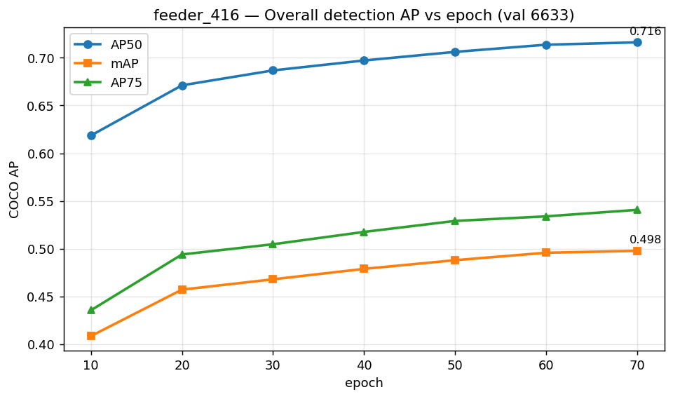
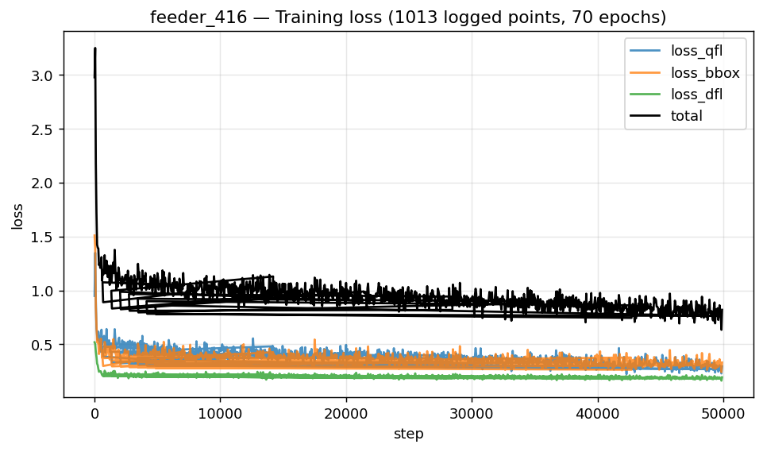

# feeder_416 · 粗检测训练指标汇总（NanoDet-Plus 416）

> 来源：3090 box `~/autodl-tmp/ect/outputs/detect/feeder_416`，完整训练跑 = `logs-2026-06-21-07-18-50`（70ep，best=末轮）。
> 本目录是该跑**训练 → 评估 → 量化模拟 → 召回**全指标 + 权重的本地存档。
> **整段叙事报告（图文并茂）见上一级 [`../检测实验报告.md`](../检测实验报告.md)**；本 README 是机读/查数索引。

## 一句话

NanoDet-Plus / ShuffleNetV2 1.0x / **416×416** / 5 类，从官方 416 COCO ckpt 微调，70ep 干净收敛，
**best=ep70 mAP@.5:.95=0.498 / mAP@.5=0.716**；**bird 召回 fp32 91.54% / int8 88.06%（命门守住，比 320 各 +4pt）**。
类间：cat 65.7 ≈ squirrel 64.1 > other_animal 60.5 > bird 37.3 > person 21.3；小目标仍几乎检不到（AP_small 0.017）。

## 训练配置（train_cfg.yml 摘）

| 项 | 值 |
|---|---|
| 架构 | NanoDet-Plus（ShuffleNetV2 1.0x + GhostPAN out96/depthwise/k5 + NanoDetPlusHead，aux detach_epoch=10）|
| 输入 | 416×416，keep_ratio=false |
| 类别 | bird / squirrel / cat / person / other_animal（5）|
| 损失 | QFL(w1.0,β2) + GIoU(w2.0) + DFL(w0.25)，reg_max=7，strides 8/16/32/64 |
| 优化 | AdamW lr 1e-3 · wd 0.05 · Cosine(T_max=100,η_min=5e-5) · warmup 500 · grad_clip 35 · EMA 0.9998 |
| 训练 | batch 96 · fp32 · 711 iter/ep · 采集到 epoch 70（best） · 初始化=官方 nanodet-plus-m_416 COCO ckpt |
| 数据 | train `labels/train_train.json`(≈68256) / val `labels/train_val.json`(6633)，feeder 4src（74978）|
| 评估 | CocoDetectionEvaluator（pycocotools），save_key=mAP，val 间隔 10ep |

## 整体指标（COCO，逐 10 epoch）



| epoch | mAP\@.5:.95 | mAP\@.5 | AP\@.75 | AP_small | AP_medium | AP_large |
|---|---|---|---|---|---|---|
| 10 | 0.409 | 0.619 | 0.436 | 0.010 | 0.078 | 0.477 |
| 20 | 0.457 | 0.671 | 0.494 | 0.015 | 0.091 | 0.530 |
| 30 | 0.468 | 0.687 | 0.505 | 0.016 | 0.092 | 0.541 |
| 40 | 0.479 | 0.697 | 0.518 | 0.016 | 0.100 | 0.553 |
| 50 | 0.488 | 0.706 | 0.529 | 0.016 | 0.104 | 0.563 |
| 60 | 0.496 | 0.714 | 0.534 | 0.017 | 0.104 | 0.572 |
| **70 (best)** | **0.498** | **0.716** | **0.541** | 0.017 | 0.112 | 0.574 |

**best(ep70) AR**：AR@1 0.449 · AR@10 0.586 · AR@100 0.626 · AR_small 0.037 · AR_medium 0.360 · AR_large 0.712
（机读 `overall_metrics.csv` / 原始 `eval_results.txt`）

## 每类 AP（AP50 / mAP\@.5:.95，单位 %）


| 类 | ep10 | ep30 | ep50 | ep70(best) |
|---|---|---|---|---|
| bird | 54.1 / 32.1 | 59.5 / 35.9 | 61.2 / 36.9 | **61.6 / 37.3** |
| squirrel | 73.3 / 51.2 | 82.8 / 59.4 | 85.5 / 62.8 | **86.4 / 64.1** |
| cat | 76.4 / 54.2 | 84.3 / 63.2 | 85.9 / 65.2 | **86.3 / 65.7** |
| person | 34.3 / 16.9 | 38.7 / 19.5 | 39.9 / 20.2 | **41.7 / 21.3** |
| other_animal | 71.2 / 49.9 | 78.1 / 56.1 | 80.6 / 58.9 | **82.1 / 60.5** |

（机读 `per_class_ap.csv`。bird/person 框准度偏低、small 目标几乎丢；喂食器看召回不看 mAP，见下。）

## 🐦 每类召回率（val 800 子集, conf≥0.3 / IoU≥0.5 / 类别正确）


| 类 | GT | fp32 召回 | int8 召回 |
|---|---|---|---|
| **bird** | 201 | **0.9154** | **0.8806** |
| squirrel | 114 | 0.8860 | 0.8421 |
| cat | 17 | 0.8824 | 0.8235 |
| other_animal | 530 | 0.9547 | 0.8887 |
| 总体 | 862 | 0.9350 | 0.8794 |

> 口径对齐实验1 / feeder_320。**fp32 bird 召回 91.54%（vs 320 的 87.56%，+4pt；vs 实验1 64.5%，+27pt）；
> int8 仍 88.06%（仅 −3.5pt，命门守住）**。延续「召回涨、mAP 中等」反转——喂食器宁多框勿漏，后接分类器细判。
> cat GT=17 噪声大；person 子集 GT=0。机读 `quant/per_class_recall_fp32_vs_int8.csv`。

## 量化（int8 模拟掉点，ORT-QDQ per-channel/opset13/calib120，方向性非板子）


| 级 | mAP@.5:.95 | AP50 | AP75 |
|---|---|---|---|
| fp32 | 0.4979 | 0.7161 | 0.5409 |
| int8_sim | 0.4573 | 0.6762 | 0.4914 |
| **掉点** | **−4.06pt** | **−3.99pt** | **−4.94pt** |

> per-class 掉点：other_animal −5.97 / cat −5.43 最多，**bird −2.82 / person −2.64 最稳**。
> 掉点主因 = ShuffleNetV2 INT8 固有量化损失（320 已验证增 calib 无效）；要压需 QAT/混合精度/换 backbone 或上板实测。
> fp32 ONNX 推理 mAP 0.4979 == 训练 best（导出零损耗，SANITY cls_maxdiff 6e-5）。详见 `quant/`。

## 训练 loss 收敛



| loss | 起 | 末 |
|---|---|---|
| loss_qfl | 0.95 | 0.28 |
| loss_bbox | 1.51 | 0.31 |
| loss_dfl | 0.52 | 0.18 |

（1014 采样点，单调无震荡；全曲线 `train_loss_curve.csv`，原始 `train_full.log`）

## 文件清单

| 文件 | 内容 |
|---|---|
| `weights/nanodet_model_best.pth` (16M) | **量化前** best 权重（PyTorch）|
| `weights/feeder_416.onnx` / `feeder_416_op13.onnx` (5.2M) | **量化前** FP32 ONNX（op13=量化输入）|
| `weights/feeder_416.int8.onnx` (2.2M) | **量化后** INT8 ONNX（ORT-QDQ，仅消融，不进部署）|
| `overall_metrics.csv` / `per_class_ap.csv` | 整体 / 每类 AP（逐 10ep）机读 |
| `train_loss_curve.csv` | 训练 3 条主 loss（逐 step，1014 点）|
| `eval_results.txt` / `train_full.log` / `train_cfg.yml` | 原始评估 / 训练日志(220K) / 配置 |
| `quant/int8_eval_416.log` | int8 mAP 评估日志（fp32+int8 全量 6633）|
| `quant/bird_recall_{fp32,int8}_416.log` | 召回评估日志 |
| `quant/per_class_fp32_vs_int8.csv` | 每类 AP fp32 vs int8 |
| `quant/per_class_recall_fp32_vs_int8.csv` | 每类召回 fp32 vs int8 |
| `quant/scripts/` | 评估脚本（int8 eval / bird recall）|
| `figures/fig1..6.png` | 全部图表 |
| `make_report_assets.py` | CSV + 图表复现脚本 |

> 权重为本地存档，**不进 git，应走 DVC**。完整预测 dump（fp32 37M / int8 53M）留在 box（重跑 COCOeval 才需要）。

## 流程位置

```
[训练 ✅本档]─导出FP32 ONNX ✅─ORT-QDQ模拟INT8 ✅─mAP/召回包络 ✅─gate ✅──┐  ← 本地全流程闭环
                                                                      └─级联端到端int8 ⏳──ACUITY/.nb真上板 ⏳（W1）
```
