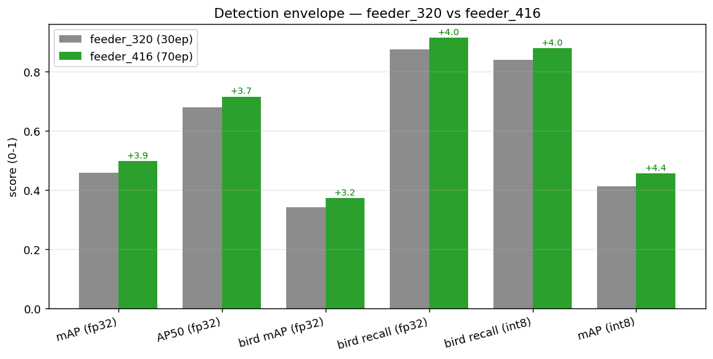

# 边侧粗检测 实验报告 · NanoDet-Plus（feeder 5 类）

> 范围：edge-cam-train **粗检测段**全过程（实验1 基线 → feeder_320 → **feeder_416 收官**）。
> 口径：COCO bbox（pycocotools）+ 喂食器场景 **bird 召回（命门）**；量化为 **ORT-QDQ 模拟 INT8**（方向性，非板子实测）。
> 产物：`results/detect/feeder_320/`、`results/detect/feeder_416/`（权重 + 指标 + 图表 + 脚本）。
> 硬件：训练在 RTX 3090（nmb2，NanoDet pin torch<2.0，不能上 5090 Blackwell）。

---

## 0. 一页结论（TL;DR）

| 维度 | 实验1 基线 | feeder_320 | **feeder_416（本轮收官）** |
|---|---|---|---|
| 数据 | 旧检测集 | feeder 4src（74978 图 / 5 类） | feeder 4src（同） |
| 输入 / epoch | 50ep | 320² · 30ep | **416² · 70ep（官方 416 COCO ckpt 微调）** |
| fp32 mAP@.5:.95 | 0.591※ | 0.459 | **0.498** |
| fp32 AP50 | 0.720※ | 0.679 | **0.716** |
| **bird 召回 fp32（命门）** | **64.5%**（真实喂食器） | 87.56% | **91.54%** |
| **bird 召回 int8（命门）** | — | 84.08% | **88.06%** |
| INT8 mAP（模拟） | — | 0.413（−4.58pt） | **0.457（−4.06pt）** |

> ※ 实验1 的 mAP 0.591 与新跑**不可直接比**——它跑在更干净的旧 val 上；新 feeder 4src 数据更难、更贴真实，
> mAP 数字反而低，但**产品命门 bird 召回从 64.5% → 91.54%（+27pt）**。这正是实验1 结论 C5
> 「真正的杠杆在检测侧 bird 召回，不在分类器」的兑现。

**判定：包络 PASS ✅**。416 这一档在 0.5T / INT8-only 约束下，**喂食器场景 bird 命门 int8 仍 88.06%**（宁多框勿漏，后接细分类器），量化掉点 4pt 出头落在可接受区。检测段本地全流程闭环；剩余缺口是 ACUITY/`.nb` 真上板实测（W1，无工具链）。

---

## 1. 背景：为什么是「粗检测 + bird 召回命门」

产品是两段式级联（详见 `docs/plan-v2.md`）：

```
原图 ─[粗检测 NanoDet-Plus]→ bird crop ─[细分类 EfficientNet-Lite0]→ 种 + 置信度 + top-5
                          └→ 非鸟大类直接出（squirrel/cat/person/other_animal）
```

- 粗检测**固定**、细分类可 OTA 换。检测只需把 **bird 框出来**交给下游，**框到 = 命门**：漏检（bird 没框出）→ 整条链路对该鸟失效；误报（多框）→ 下游分类器还能兜（出低置信/回退）。
- 所以**评估第一优先是 bird 召回**（recall，conf≥0.3/IoU≥0.5/类别正确），而非 mAP（框准度）。实验1 已证明：**mAP 高 ≠ 真实场景 bird 检得出**（实验1 mAP 0.591 但真实喂食器 bird 检出仅 64.5%）。
- 5 类口径：`bird / squirrel / cat / person / other_animal`（ADR-0004）。后处理（decode/NMS/grid/sigmoid）留 A7 CPU，NPU 只跑 backbone+head（§4 铁律）。

---

## 2. 数据与训练配方（feeder_416）

**数据**：feeder 4 源合并 v1，**74978 图**（train ≈ 68256 / val **6633**），5 类 COCO 标注（`detect_raw/processed/labels/`）。

**模型 / 训练配置**（`feeder_416/train_cfg.yml` 摘）：

| 项 | 值 |
|---|---|
| 架构 | NanoDet-Plus：ShuffleNetV2 **1.0x** backbone + GhostPAN(out96, depthwise, k5) + NanoDetPlusHead（aux head detach_epoch=10）|
| 输入 | **416×416**，keep_ratio=false |
| 类别 | bird / squirrel / cat / person / other_animal（5）|
| 损失 | QFL(w1.0, β2) + GIoU(w2.0) + DFL(w0.25)，reg_max=7，strides 8/16/32/64 |
| 优化 | AdamW lr **1e-3** · wd 0.05 · CosineAnnealing(T_max=100, η_min=5e-5) · warmup linear 500 step · grad_clip 35 |
| 训练 | batch **96** · **precision 32(fp32)** · EMA decay 0.9998 · 711 iter/ep · 采集到 **epoch 70（best=末轮）** |
| 初始化 | **官方 `nanodet-plus-m_416_checkpoint.ckpt`（COCO）微调** |
| 评估 | CocoDetectionEvaluator（pycocotools），save_key=mAP，val 间隔 10ep |

> 注：config `total_epochs=100`，本轮采集/收官在 **epoch 70**；ep60→70 mAP 仅 +0.20pt，已近平台。
> 与 feeder_320（30ep、320²）相比，416 是**更高分辨率 + 更多 epoch + 416 匹配的 COCO 预训练**三者叠加的更强配方——
> 故 320→416 的增益是**配方整体**的收益，非单纯分辨率。

---

## 3. 训练结果（FP32）

### 3.1 整体收敛


| epoch | mAP@.5:.95 | AP50 | AP75 | AP_small | AP_medium | AP_large |
|---|---|---|---|---|---|---|
| 10 | 0.409 | 0.619 | 0.436 | 0.010 | 0.078 | 0.477 |
| 30 | 0.468 | 0.687 | 0.505 | 0.016 | 0.092 | 0.541 |
| 50 | 0.488 | 0.706 | 0.529 | 0.016 | 0.104 | 0.563 |
| 60 | 0.496 | 0.714 | 0.534 | 0.017 | 0.104 | 0.572 |
| **70 (best)** | **0.498** | **0.716** | **0.541** | 0.017 | 0.112 | 0.574 |

**best(ep70) AR**：AR@1 0.449 · AR@10 0.586 · AR@100 0.626 · AR_small 0.037 · AR_medium 0.360 · AR_large 0.712。
机读见 `feeder_416/overall_metrics.csv`，原始 `feeder_416/eval_results.txt`。

### 3.2 每类 AP


best(ep70) 每类 **AP50 / mAP@.5:.95（%）**：

| 类 | AP50 | mAP | 解读 |
|---|---|---|---|
| cat | 86.3 | **65.7** | 目标大、样本干净，最好 |
| squirrel | 86.4 | 64.1 | 同上 |
| other_animal | 82.1 | 60.5 | 杂类但量大 |
| **bird** | 61.6 | **37.3** | **命门类**；框准度中等（小目标多、姿态杂），但**召回是关键，见 §5** |
| person | 41.7 | 21.3 | 最弱（喂食器场景 person 少、远、被遮挡）|

> 短板与 320 一致：**bird/person 的框准度（mAP）偏低 + 小目标几乎检不到**（AP_small 0.017）。
> 但喂食器命门看召回不看 mAP——bird mAP 37.3 不致命，bird 召回 91.5% 才是产品成立的依据。

### 3.3 训练 loss


70 epoch（1014 个采样点）三条主 loss 平滑单调下降，无震荡/过拟合迹象：

| loss | 起 | 末 |
|---|---|---|
| loss_qfl | 0.95 | 0.28 |
| loss_bbox | 1.51 | 0.31 |
| loss_dfl | 0.52 | 0.18 |

机读 `feeder_416/train_loss_curve.csv`，原始 `feeder_416/train_full.log`。

---

## 4. 量化（FP32 → INT8 模拟）

口径：**ORT-QDQ per-channel / opset13 / calib120**，对 best(ep70) 导出的 FP32 ONNX 做训练后量化，**全量 val 6633 图**重测。SANITY：pt-eval vs ONNX-delogit `cls_maxdiff=6e-5 / reg_maxdiff=1e-5`（导出零损耗）。

> ⚠️ 这是**本地方向性预估**，非板子实测。Vivante 私有量化，真实掉点须 ACUITY/pegasus PTQ → `.nb` → 上板（§4 铁律 1，W1 无工具链）。INT8 列只进消融，不进部署。


| 指标 | fp32 | int8 | 掉点 |
|---|---|---|---|
| mAP@.5:.95 | 0.4979 | 0.4573 | **−4.06pt** |
| AP50 | 0.7161 | 0.6762 | −3.99pt |
| AP75 | 0.5409 | 0.4914 | −4.94pt |
| AP_small | 0.0166 | 0.0120 | −0.46pt |

每类 mAP 掉点：**other_animal −5.97 / cat −5.43 最多**，**bird −2.82 / person −2.64 较稳**。
机读 `feeder_416/quant/per_class_fp32_vs_int8.csv`。

> 与 320 一致的结论：掉点主因是 **ShuffleNetV2 INT8 固有量化损失**，非校准不足（320 已验证 calib 120→1000 仅压回 0.20pt）。
> 要再压需 QAT / 混合精度 / 换 backbone，或待板子 ACUITY 实测。**好消息：命门类 bird 量化最稳（mAP 仅 −2.82）。**

---

## 5. 🐦 召回（命门）：FP32 vs INT8

口径对齐实验1：val **800 子集**，conf≥0.3 / IoU≥0.5 / 类别正确。


| 类 | GT | fp32 召回 | int8 召回 | 量化掉点 |
|---|---|---|---|---|
| **bird** | 201 | **91.54%** (184) | **88.06%** (177) | −3.48pt |
| squirrel | 114 | 88.60% (101) | 84.21% (96) | −4.39pt |
| cat | 17 | 88.24% (15) | 82.35% (14) | −5.89pt（GT=17 噪声大）|
| other_animal | 530 | 95.47% (506) | 88.87% (471) | −6.60pt |
| **总体** | 862 | 93.50% (806) | 87.94% (758) | −5.56pt |

> person 子集 GT=0,不计。机读 `feeder_416/quant/per_class_recall_fp32_vs_int8.csv`。

**核心读数**：
1. **命门守住**——int8 bird 召回 **88.06%**，量化只掉 3.48pt；fp32 91.54%。喂食器「宁多框勿漏」成立。
2. bird 量化**最稳**（召回掉点最小），与 §4 的 bird mAP 量化最稳一致——对产品是好消息。
3. 召回 ≫ mAP 的「反转」延续：模型对鸟「更敢报」（漏检少→召回高），定位不精→mAP 中等。**喂食器只需召回。**

---

## 6. 演进：实验1 → 320 → 416



| 跳变 | 关键变化 | 命门收益 |
|---|---|---|
| 实验1 → feeder_320 | 换 **4src 真实喂食器数据**（74978 图）+ 5 类口径 | bird 真实检出 **64.5% → 87.56%（+23pt）** |
| feeder_320 → feeder_416 | **416² + 70ep + 416 COCO 预训练** | bird 召回 fp32 **87.56→91.54（+4.0）**、int8 **84.08→88.06（+4.0）**；mAP **0.459→0.498（+3.9）** |

> feeder_320 vs feeder_416 是**同数据集 apples-to-apples** 比较（fig6 可信）。
> 实验1 的 mAP 0.591 因 val 集不同**不入此比较**——它的真实命门只有 64.5%，正是被新数据修复的对象。

**实验1 五条结论的兑现情况**：
- C5「真正杠杆在检测侧 bird 召回 + 真实数据」→ ✅ 已兑现（64.5%→91.54%）。
- C2「两段对 INT8 PTQ 友好」→ ✅ 延续（检测 int8 mAP 掉 4pt、bird 召回掉 3.5pt，方向友好）。
- C3「级联端到端会暴露 mAP 测不出的框质量伤害」→ ⏳ 本轮只到检测段，**级联端到端 + int8 框质量复测仍待补**（见 §7）。

---

## 7. 结论 / Gate / 下一步

**Gate（fp32+int8 两档，ADR-0001 包络优先、暂不设硬门）：PASS ✅**
- fp32：mAP 0.498 / AP50 0.716 / bird 召回 91.5%。
- int8(模拟)：mAP 0.457 / AP50 0.676 / **bird 召回 88.1%（命门）**。
- 掉点 4pt 出头、bird 命门量化最稳——**在 0.5T/INT8-only 下喂食器可行性成立**。

**缺口 / 下一步**：
1. **级联端到端 + int8 复测**（实验1 C3：检测框质量对级联的伤害 mAP 测不出，需端到端才暴露）——检测目前缺像分类 `run_envelope` 那样的端到端检测编排入口。
2. **小目标**（AP_small 0.017）几乎检不到——远处小鸟是潜在漏检源；可试更大输入 / FPN 调整 / 数据补强。
3. **真上板**：ACUITY/pegasus PTQ → `.nb` → VIPLite 实测真实掉点 + latency（W1，工具链未通，是最大盲点）。
4. **person 最弱**——但喂食器场景优先级低，暂不投入。

**流程位置**：
```
[训练✅]─导出FP32 ONNX✅─ORT-QDQ模拟INT8✅─mAP/召回包络✅─gate✅──┐  ← 本地全流程已闭环（本报告）
                                                              └─级联端到端int8⏳──ACUITY/.nb真上板⏳（W1）
```

---

## 8. 产物清单

| 路径 | 内容 |
|---|---|
| `feeder_416/weights/nanodet_model_best.pth` (16M) | **量化前** best 权重（PyTorch，导 ONNX 用）|
| `feeder_416/weights/feeder_416.onnx` / `_op13.onnx` (5.2M) | **量化前** FP32 ONNX（op13 为量化输入）|
| `feeder_416/weights/feeder_416.int8.onnx` (2.2M) | **量化后** INT8 ONNX（ORT-QDQ，仅消融，不进部署）|
| `feeder_416/overall_metrics.csv` · `per_class_ap.csv` · `train_loss_curve.csv` | 机读指标/曲线 |
| `feeder_416/eval_results.txt` · `train_full.log` · `train_cfg.yml` | 原始评估/训练日志/配置 |
| `feeder_416/quant/*.log` · `per_class_*_fp32_vs_int8.csv` · `scripts/` | 量化/召回日志 + 对比表 + 评估脚本 |
| `feeder_416/figures/fig1..6.png` | 本报告全部图表 |
| `feeder_416/make_report_assets.py` | 图表/CSV 复现脚本 |

> 完整预测 dump（`results_fp32_onnx.json` 37M / `results_int8_onnx.json` 53M）留在 3090 box（重跑 COCOeval 才需要，未下载）。
> 权重为本地存档，**不进 git，应走 DVC**（`data/` 已 DVC 跟踪）。

---
*生成于 2026-06-21；数据源：3090 `~/autodl-tmp/ect/outputs/detect/`。报告 + 图表可由 `feeder_416/make_report_assets.py` 复现。*
